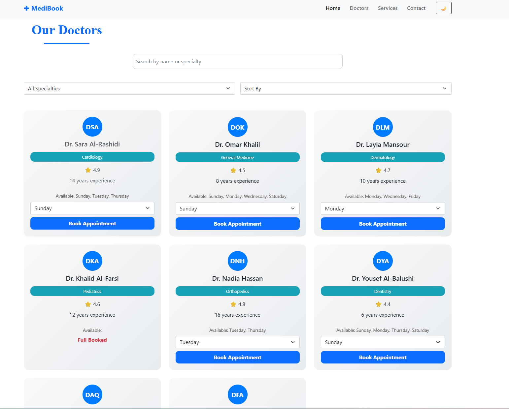

# 🏥 MediBook Appointment System


## 📌 Overview

MediBook is a healthcare appointment booking system built with Angular and TypeScript.

The application enables patients to browse doctors, view available schedules, and book appointments through a responsive and user-friendly interface.

This project showcases Angular fundamentals, routing, services, component-based architecture, and modern frontend development practices.
---

## ✨ Features

- 👨‍⚕️ View available doctors
- 📅 Book appointments online
- 🔍 Search and filter doctors
- 📝 Appointment management
- 📱 Responsive user interface
- ⚡ Fast and user-friendly experience
- 🧩 Component-based Angular architecture

---

## 🛠️ Technologies Used

- Angular
- TypeScript
- HTML5
- CSS3
- Bootstrap
- Angular Routing
- Angular Services

---

## 📂 Project Structure

```text
src/
│
├── app/
│   ├── components/
│   ├── services/
│   ├── models/
│   ├── pages/
│   └── shared/
│
├── assets/
├── environments/
└── styles/
```

---

## 🚀 Getting Started

### Clone Repository

```bash
git clone https://github.com/Anoudalsaidi/MediBook-Appointment-System-Angular.git
```

### Install Dependencies

```bash
npm install
```

### Run Application

```bash
ng serve
```

Open:

```text
http://localhost:4200
```

---

## 🎯 Learning Objectives

This project helped strengthen skills in:

- Angular Fundamentals
- TypeScript Development
- Component Communication
- Routing & Navigation
- Service Layer Design
- Responsive UI Development

---

## 📸 Screenshots

## Home Page
<p align="center">
  
</p>


## Appoinment Section
<p align="center">
  
</p>

---

## 👩‍💻 Author

**Anoud Al Saidi**

GitHub:
https://github.com/Anoudalsaidi

---

## ⭐ Support

If you found this project useful, consider giving it a star ⭐ on GitHub.
